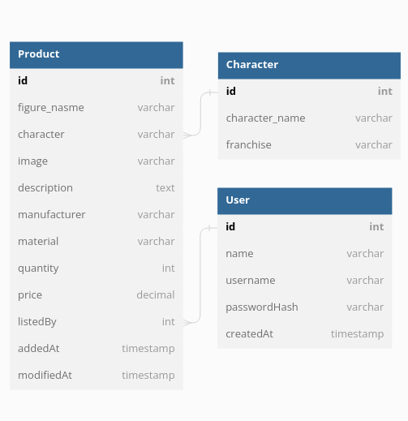

# Figures Inventory App
A simple inventory application using Node.js, Express, Pug template as the view engine, and MongoDB as the database.

This application allows users to CRUD operations for figures and characters from the inventory. The application uses Tailwind CSS for styling and express-validator for input validation.

## Features
- View a list of all figures and characters
- View details for individual figures and characters
- Add new figures and characters to the inventory
- Update existing figures and characters
- Delete figures and characters from the inventory

## Database Diagram

Edit: I added background (type: varchar) field for the Character Model.

## How to setup application
1. Clone the repository
2. Install dependencies: `npm install`
3. Create a `.env` file in the root folder of the project and add the following variables:
   - TEST_MONGODB_URI=your_test_mongodb_uri (for testing purposes)
   - MONGODB_URI=your_mongodb_uri (for production)
   - NODE_ENV=development
   - PORT=3000
4. Run the application: `npm run devstart`
5. Open your browser and navigate to `http://localhost:3000`